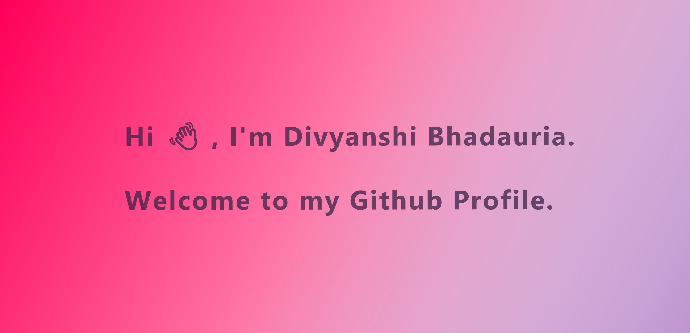

<!--
**BhadauriaDivya/bhadauriadivya** is a ✨ _special_ ✨ repository because its `README.md` (this file) appears on your GitHub profile.

Here are some ideas to get you started:

- 🔭 I’m currently working on ...
- 🌱 I’m currently learning ...
- 👯 I’m looking to collaborate on ...
- 🤔 I’m looking for help with ...
- 💬 Ask me about ...
- 📫 How to reach me: ...
- 😄 Pronouns: ...
- ⚡ Fun fact: ...
-->

<!---->
<h1><b>Hi 👋, I'm Divyanshi Bhadauria.</b></h1>
  
 -🔭 I’m currently a MCA Student at KIET Group of Institution

  
 - 🌱 I’m currently learning Web developement and DSA

 

  
## Programming Languages:

 

## Frontend Development:

 

 

 

 ## Backend Development:

 

 ## Database:

 

 

  

 ## Software:

  

 

 ## Other:

 

## 🔎 Connect with me:

 

